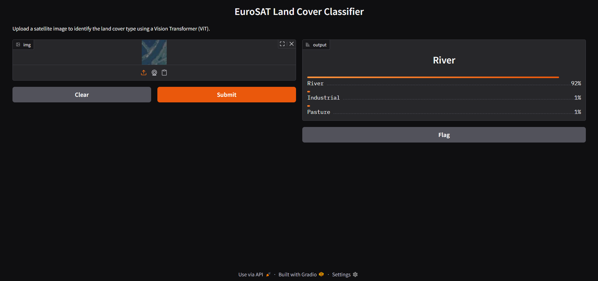
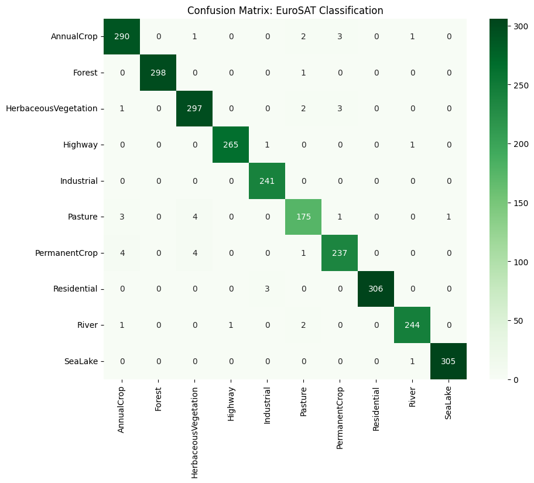

Project overview

This project implements a state-of-the-art Satellite Image Classifier using the Vision Transformer (ViT) architecture. The system classifies Sentinel-2 satellite images into 10 distinct land cover categories (e.g., Forests, Industrial, Residential, Crops).

The primary goal is to demonstrate the power of Transfer Learning and the Self-Attention mechanism in Computer Vision, specifically for remote sensing applications where global spatial relationships are key.

------------------------------------------------------------------------------------------------------------------------------------------------------------------------

- The model used and fine tuned is "google/vit-base-patch16-224-in21k"

- Dataset: euroSAT, in this specific case Amite5h/Eurosat-Datast from HuggingFace

- In the project it is included a web app developed with Gradio, to visualize the results and test the model.

To optimize VRAM usage, I implemented a Lazy Loading pipeline using the .with_transform() method. Instead of storing processed tensors in memory, images are dynamically resized to 224 x 224 and normalized only when requested by the GPU during a training batch.

# Model Weights
Due to file size limitations on GitHub, the fine-tuned model weights are hosted on **Hugging Face Hub**.
You can find the model here: [https://huggingface.co/gilladog/vit-base-eurosat]

----------------------------
-------How to run-----------
----------------------------

1. Dowload the files

2. Install the requirements "pip install -r requirements.txt"

3. Run the Gui with "python demo.py"

4. Go to the webpage of the local host shown on the terminal

----------------------------
----------RESULTS-----------
----------------------------

These are the results obtained after the fine tuning:
| Class | Precision | Recall | F1-Score | Support |
| :--- | :---: | :---: | :---: | :---: |
| **Annual Crop** | 0.97 | 0.98 | 0.97 | 297 |
| **Forest** | 1.00 | 1.00 | 1.00 | 299 |
| **Herbaceous Vegetation** | 0.97 | 0.98 | 0.98 | 303 |
| **Highway** | 1.00 | 0.99 | 0.99 | 267 |
| **Industrial** | 0.98 | 1.00 | 0.99 | 241 |
| **Pasture** | 0.96 | 0.95 | 0.95 | 184 |
| **Permanent Crop** | 0.97 | 0.96 | 0.97 | 246 |
| **Residential** | 1.00 | 0.99 | 1.00 | 309 |
| **River** | 0.99 | 0.98 | 0.99 | 248 |
| **Sea Lake** | 1.00 | 1.00 | 1.00 | 306 |
| | | | | |
| **Accuracy** | | | **0.98** | **2700** |
| **Macro Avg** | 0.98 | 0.98 | 0.98 | 2700 |
| **Weighted Avg** | 0.98 | 0.98 | 0.98 | 2700 |

